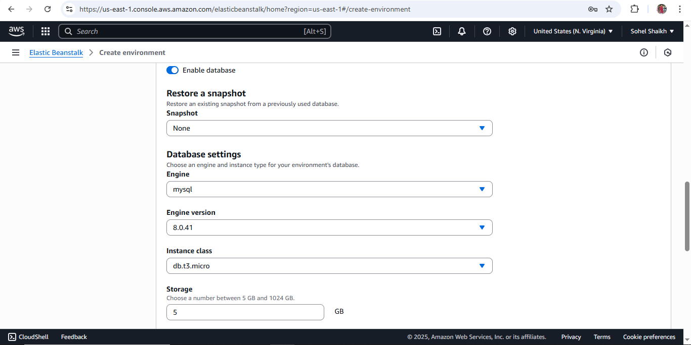
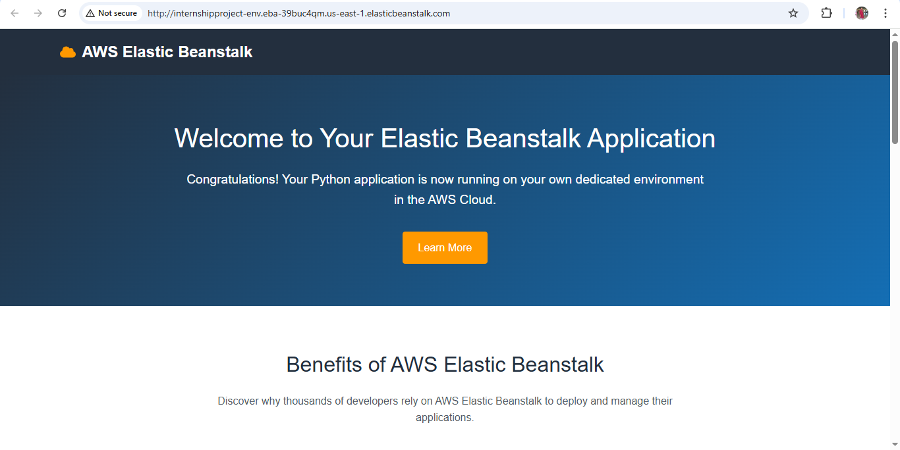
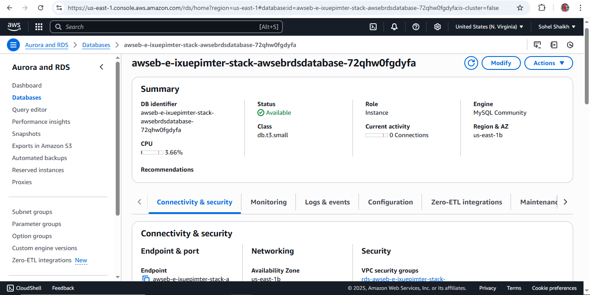
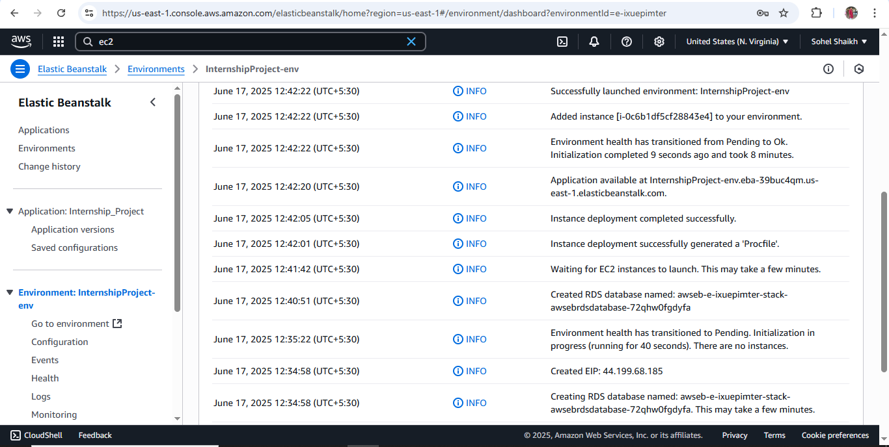
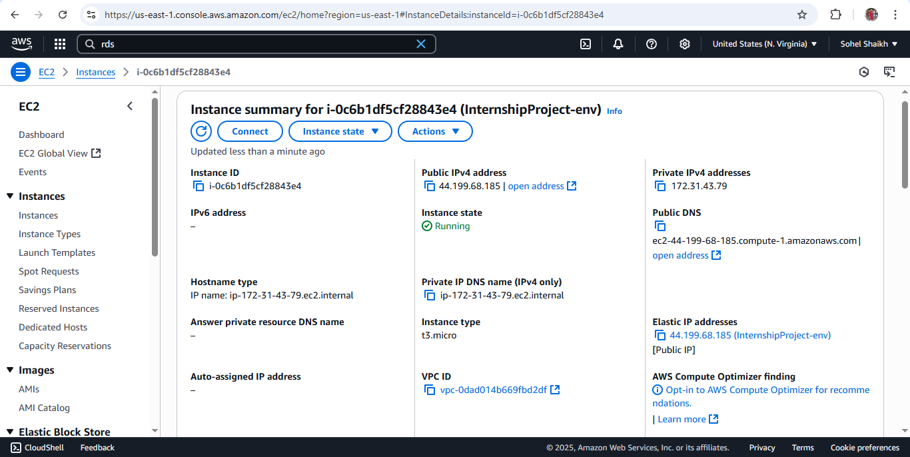
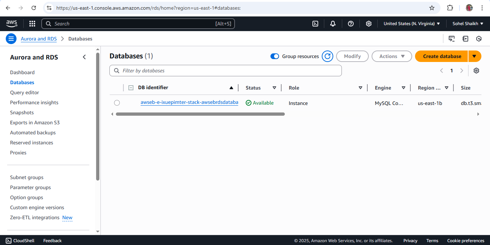

# 📘 Project: Deploying RDS with Elastic Beanstalk and Accessing via EC2

## 🎯 Objective
Learn how to deploy a web application using AWS Elastic Beanstalk with an integrated Amazon RDS database and access it securely from an EC2 instance in the same VPC.

---

## ✅ Project Requirements

### 1. Elastic Beanstalk Environment Setup
- Deploy a sample application using Elastic Beanstalk (Node.js, Python Flask, PHP, etc.)
- While creating the environment:
  - Enable RDS creation (MySQL/PostgreSQL)
  - Ensure RDS is launched in the same VPC

### 2. RDS Configuration
- Public accessibility: Optional (used for secure access when required)
- Security Group Rules:
  - Allow database access from the Elastic Beanstalk environment
  - Allow access from a specific EC2 instance

### 3. EC2 Instance Setup
- Launch an EC2 instance in the same VPC
- SSH into the instance and install a DB client (`mysql` or `psql`)
- Connect to the RDS using credentials and endpoint

### 4. Optional Enhancements
- Securely store RDS credentials using:
  - AWS Systems Manager Parameter Store
  - AWS Secrets Manager
- Create a test script to perform DB read/write operations
- Enable monitoring with Amazon CloudWatch

---

## 🛠️ Technologies & Tools Used
- AWS Elastic Beanstalk
- Amazon RDS (MySQL)
- Amazon EC2
- AWS VPC, Subnets, Security Groups
- (Optional) AWS Systems Manager, CloudWatch

---

## 🗂️ Folder Structure
```
.
├── README.md
└── project_ss/
    ├── Beanstalk_RDS-config.png
    ├── Ec2-lauchbyBeanstalk.png
    ├── elastickbeanstalk-deploy.png
    ├── Env&RDS-Launched.png
    ├── RDS-console.png
    ├── Screenshot (93).png
    ├── ssm-para_via_console.png
    └── successful_launch-rds_onEC2.png
```

---

## 🧱 Architecture Overview


---

## 📸 Output Examples

### ✅ Environment Launch


### ✅ RDS Created During Launch


### ✅ Application + RDS + EC2 Access




---

## 🔐 Security Considerations
- RDS should **not** be publicly accessible unless needed for external access.
- MySQL (port 3306) must be restricted using Security Groups to allow access **only from trusted sources**.
- Use IAM roles, Secrets Manager, or Parameter Store for **secure credential management**.

---

## ✍️ Author
**Sohel Shaikh** — AWS Cloud & DevOps Engineer  
Reach out for collaboration, suggestions, or feedback.

---

## 📚 References
- [AWS Elastic Beanstalk Documentation](https://docs.aws.amazon.com/elasticbeanstalk/)
- [Amazon RDS Documentation](https://docs.aws.amazon.com/rds/)
- [Amazon EC2 Documentation](https://docs.aws.amazon.com/ec2/)
